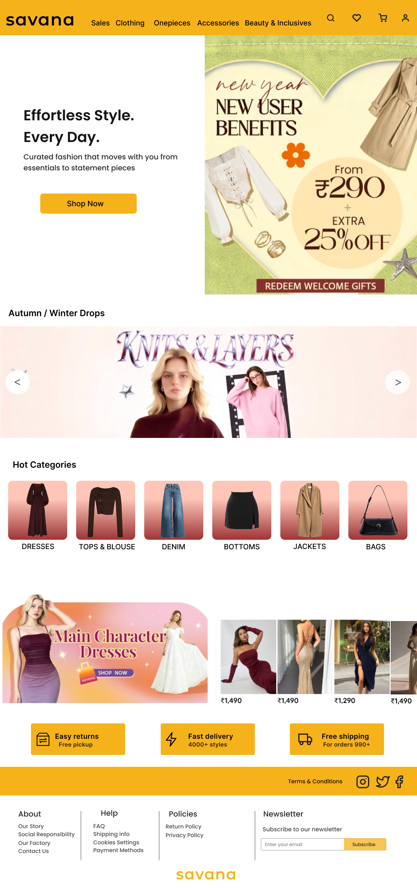

# Savana Website – Final UI Design

## Overview
This file contains the final high-fidelity UI design for the Savana website redesign project. The interface was redesigned from a mobile-focused layout into a cleaner and more structured desktop experience.

The final design focuses on usability, visual hierarchy, and improving the overall shopping journey while maintaining the brand’s promotional identity.

---

## Design Goals
- Create a modern desktop shopping interface  
- Improve navigation and content organization  
- Reduce visual clutter  
- Enhance product discoverability  
- Establish clear visual hierarchy  

---

## Features Included
- Desktop navigation bar  
- Hero section with promotional banner and CTA  
- Seasonal product showcase  
- Hot categories section  
- Product preview cards  
- Service information cards  
- Structured footer layout  

---

## Key Improvements
- Cleaner and more balanced layout  
- Better spacing and alignment  
- Simplified navigation experience  
- Improved readability and section hierarchy  
- Organized product browsing flow  

---

## Design Approach
The UI was designed using a structured grid layout with emphasis on:
- Consistency  
- Accessibility  
- User flow  
- Content prioritization  
- Minimal but engaging visual presentation  

---

## Tools Used
- Figma  

---

## Related Files
- Original UI Analysis  
- Low Fidelity Wireframes  
- Before vs After Comparison  

