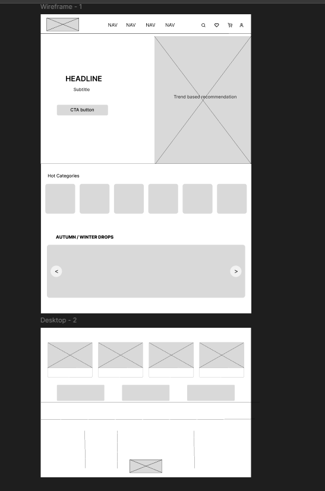

# Savana Website – Low Fidelity Wireframes

## Overview
This file contains the low-fidelity wireframes created during the early planning stage of the Savana website redesign project.

The wireframes were designed to establish layout structure, content hierarchy, and user flow before moving into high-fidelity UI design.

---

## Purpose
- Plan the desktop layout structure  
- Organize sections and spacing  
- Define navigation and content flow  
- Prioritize usability before visual styling  

---

## Wireframe Sections
- Navigation Bar  
- Hero Section with CTA  
- Featured Recommendation Area  
- Hot Categories Section  
- Product Carousel / Seasonal Drops  
- Promotional Cards  
- Footer Layout  

---

## Key Focus Areas
- Clean desktop content distribution  
- Improved visual hierarchy  
- Balanced spacing and alignment  
- Simplified shopping experience  
- Better product discoverability  

---

## Tools Used
- Figma  

---

## Design Process
These wireframes served as the structural foundation for the final UI redesign and helped translate ideas into a functional desktop layout before applying branding, typography, and visual components.

---

## Related Files
- Original UI Analysis  
- Final UI Redesign  
- Before vs After Comparison  
