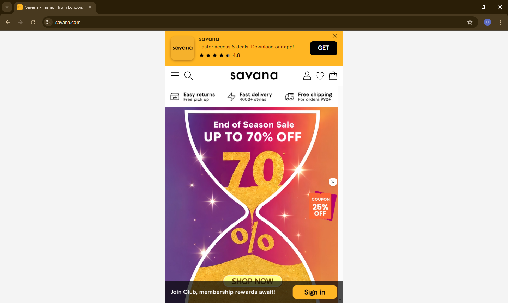

# Savana Website – Original UI Analysis

## Overview

This file contains the original Savana website interface used for the redesign project. The analysis focuses on identifying usability issues, layout limitations, and opportunities for improving the overall desktop user experience.

## Key Observations

* Promotion-heavy interface with multiple competing banners
* Weak visual hierarchy and crowded layout
* Mobile-first structure not optimized for desktop screens
* Limited navigation clarity and product discoverability

## Purpose

The original UI was studied to understand existing design problems and create a stronger, cleaner, and more user-friendly redesign solution.

## Tools Used

* Figma
* UI/UX Analysis

## Related Files

* Wireframes
* Redesigned UI
* Before vs After Comparison

